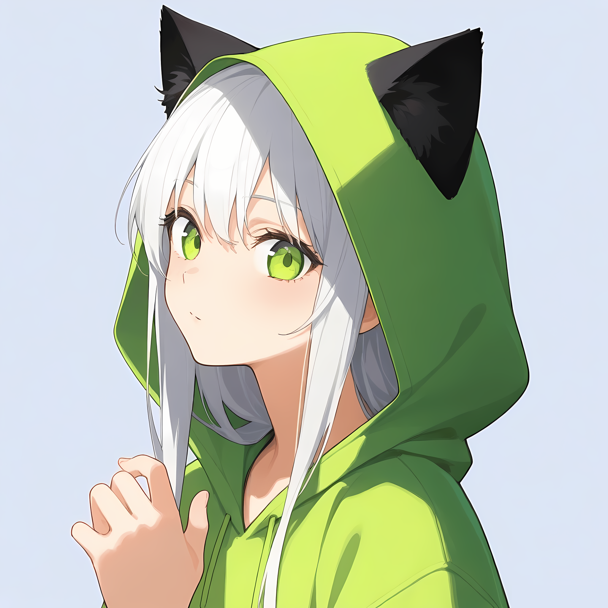

# 🐈‍⬛ Hello World!! 🐈‍⬛

    

    <b>Student Developer / AI & Web Systems</b>

    
    

<section>
    <h2>▶ Status & Philosophy</h2>
    
黒猫とメロンパンを強く愛好する学生デベロッパー

    <ul>
        <li><b>Name:</b> Tutu22 / ツツ</li>
        <li><b>Role:</b> 学生 / プログラマー</li>
        <li>
            <b>Focus:</b> AI / Discord Bot / Web & App 開発 /
            ロゴデザイン
        </li>
        <li>
            <b>Hobby:</b> メロンパン, 音楽視聴, 自由研究,
            ゆったりアニメ, ロゴデザイン, 猫コンテンツ視聴
        </li>
    </ul>
</section>

<section>
    <h2>▶ Tools & Technologies</h2>
    

        
        
        
        
    

    

        
        
        
        
    

</section>

<section>
    <h2>▶ GitHub Activity</h2>
    

        
        
    

    

        
    

</section>
